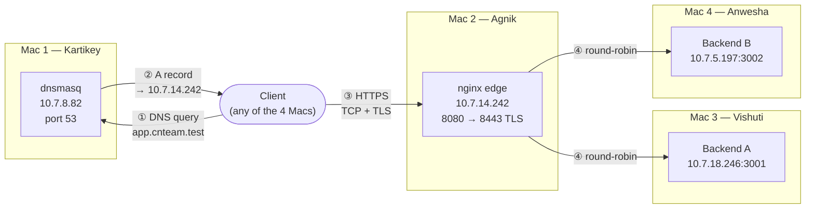

# Architecture Document — Private Network Service Platform

Team Axis, Section D. Computer Networks course project: a fully local, private
network built from scratch across 4 macOS laptops — no cloud, no pre-configured
servers.

## 1. Topology

All 4 machines sit on the same private LAN — campus Wi-Fi subnet `10.7.0.0/19`,
gateway `10.7.0.1` (a phone hotspot is the documented fallback if the campus Wi-Fi
blocks laptop-to-laptop traffic).

## 2. Machine roles and IP table

| Machine | Owner | Role | Private IPv4 | Interface | MAC | Represents |
|---|---|---|---|---|---|---|
| Mac 1 | Kartikey | Private DNS server + test client | 10.7.8.82 | en0 | ee:03:6e:af:2b:e7 | Route 53 equivalent |
| Mac 2 | Agnik | nginx edge reverse proxy + load balancer + TLS | 10.7.14.242 | en0 | fa:4e:b4:04:d0:00 | Cloud LB / CDN edge |
| Mac 3 | Vishuti | Backend A, port 3001 | 10.7.18.246 | en0 | 10:9f:41:a9:20:0d | App server instance A |
| Mac 4 | Anwesha | Backend B, port 3002 + test client | 10.7.5.197 | en0 | 0a:8f:b2:2d:a4:fb | App server instance B |

Subnet/gateway for all 4: `255.255.224.0` (/19), gateway `10.7.0.1`.

## 3. Domain

`app.cnteam.test` and `api.cnteam.test` both resolve to Mac 2 (`10.7.14.242`) via
Mac 1's dnsmasq. `.test` is used deliberately — `.local` conflicts with macOS mDNS.

## 4. Request-flow by protocol layer

| Step | Layer | What happens | Port |
|---|---|---|---|
| 1 | Application (DNS) | Client queries `app.cnteam.test` | UDP 53 → Mac 1 |
| 2 | Application (DNS) | Mac 1 answers with Mac 2's IP | UDP 53 |
| 3 | Transport (TCP) | Client ↔ Mac 2 three-way handshake (SYN/SYN-ACK/ACK) | TCP 8443 |
| 4 | Session/Transport (TLS) | ClientHello → ServerHello → Certificate → Key Exchange → Finished | TCP 8443 |
| 5 | Application (HTTP) | Encrypted `GET /api/status` request/response | TCP 8443 |
| 6 | Load balancing | nginx proxies to Backend A or B, round-robin | TCP 3001/3002 (internal, LAN-only) |
| 7 | Application (HTTP) | Backend returns JSON + `X-Backend` + `Cache-Control` headers | — |

The client never resolves or connects to a backend IP directly — nginx's
`upstream backend_pool` is the only place those addresses exist, same separation of
concerns a cloud load balancer (AWS ALB / GCP LB) provides.

## 5. Why 8080/8443 instead of 80/443

Homebrew's nginx binds 8080 by default so it can run without sudo. The project
explicitly allows this substitution with no marks lost — documented here and kept
consistent across every script, config, and piece of evidence in this repo.

## 6. TLS

Self-signed certificate, `CN=app.cnteam.test`, SAN covers `app.cnteam.test` and
`api.cnteam.test`, RSA 2048, 365-day validity, generated with OpenSSL on Mac 2.
TLS terminates at the edge (Mac 2) — traffic from Mac 2 to the backends is plain
HTTP inside the private LAN. All 4 machines trust the certificate; the final
demo uses no `curl -k` anywhere.

## 7. Load balancing

Round-robin (nginx's default) across `upstream backend_pool { server
10.7.18.246:3001; server 10.7.5.197:3002; }`, with `max_fails=2 fail_timeout=5s`
passive health checking so a stopped backend is automatically routed around.
Verified by repeated requests showing `X-Backend` alternating `A`/`B`.

## 8. Single point of failure

Mac 2 (the edge) is still a SPOF in this design — if nginx or that machine goes
down, DNS still resolves but nothing answers. Removing it would need a second edge
node and a failover mechanism between them (Phase 2's Extension E, DNS-based
cutover, demonstrates this manually).

## 9. Per-machine detail

Each machine has its own README, scripts, detailed architecture notes, and viva
prep in its folder:
- [`mac1-kartikey-dns/`](./mac1-kartikey-dns) — dnsmasq config, backup DNS, TTL demo
- [`mac2-agnik-nginx-edge/`](./mac2-agnik-nginx-edge) — nginx, load balancer, TLS
- [`backend_a/`](./backend_a) — Backend A, firewall isolation
- [`backend_b/`](./backend_b) — Backend B, client-side protocol evidence

## 10. Evidence

See [`EVIDENCE_INDEX.md`](./EVIDENCE_INDEX.md) for a task-by-task map of every piece
of evidence in this repo, so any item can be found in under 30 seconds.

## 11. Phase 1 required failure demonstrations — all 5 done

| # | Scenario | Driven by | Expected result | Confirmed |
|---|---|---|---|---|
| 1 | Wrong DNS server on a client | Kartikey | Name lookup fails, direct IP/ping still works | ✅ |
| 2 | DNS record points to wrong IP | Kartikey | Resolution succeeds, client reaches wrong host | ✅ |
| 3 | One backend stopped | Vishuti + Agnik | Edge continues serving via remaining backend, no errors | ✅ |
| 4 | Both backends stopped | Vishuti + Anwesha + Agnik | DNS/TLS still work, `502 Bad Gateway` from the app layer | ✅ |
| 5 | Wrong destination port on a client | Anwesha | Host reachable (ping OK), that port's connection refused | ✅ |

## 12. Phase status

**Phase 1: complete** — build, live verification, and all 5 failure demos done
across all 4 machines, with evidence captured for each.

**Phase 2: not started**, gated behind Phase 1 sign-off. Planned: backup DNS
resolver (Extension A), DNS TTL + controlled record change (Extension B), backend
service isolation via firewall (Extension C), HA failover formal writeup
(Extension D), DNS-based edge cutover (Extension E), faculty-injected
troubleshooting challenge (Extension F).
